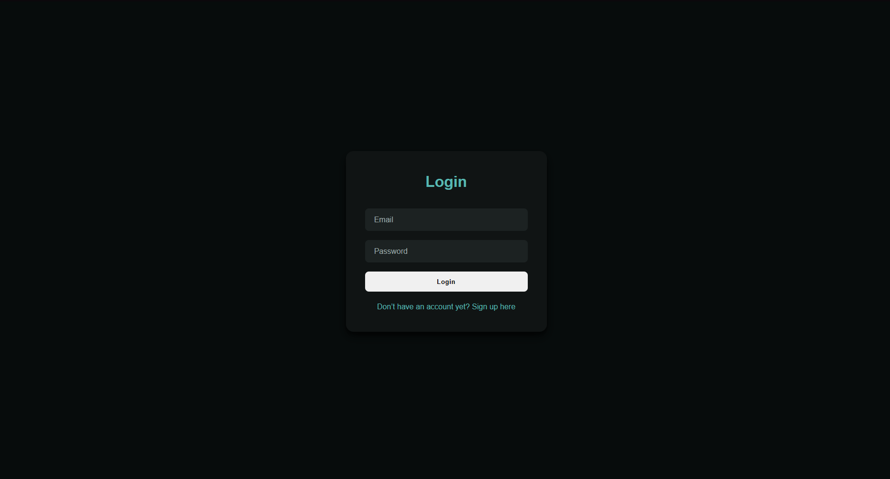
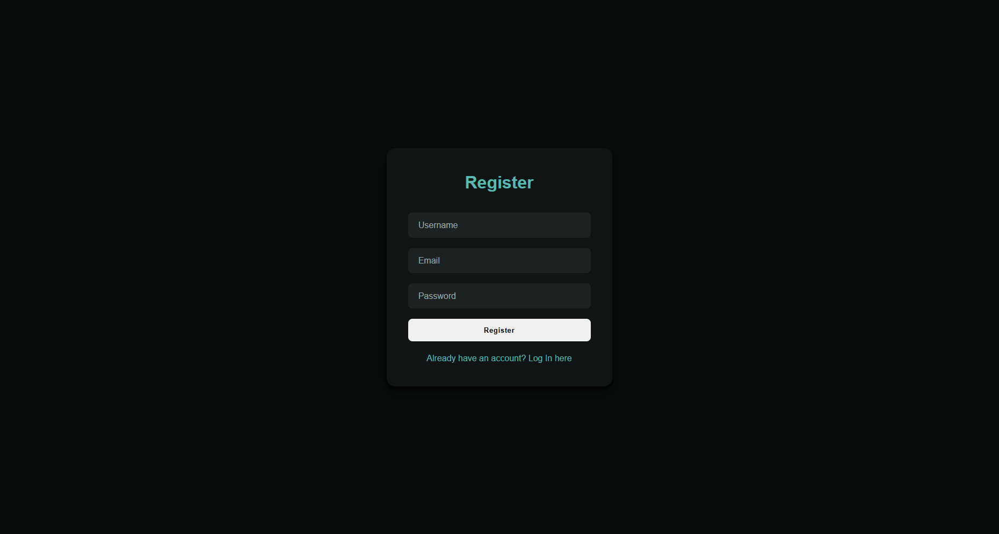
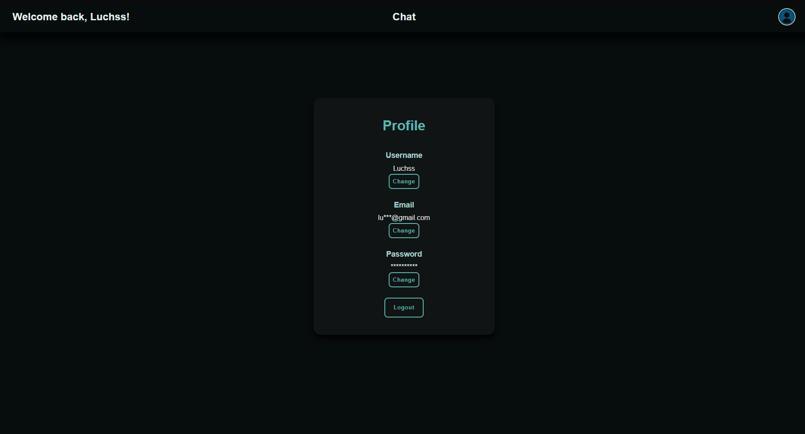
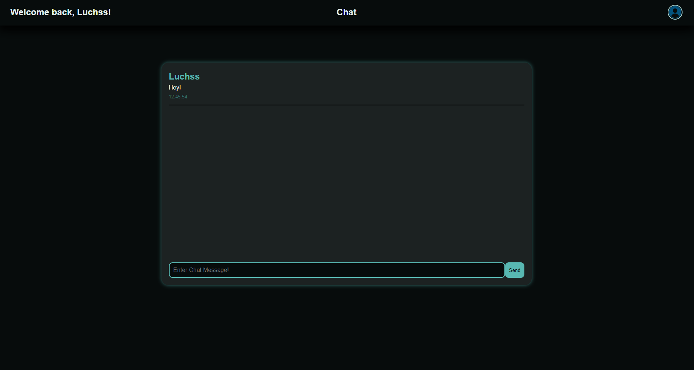
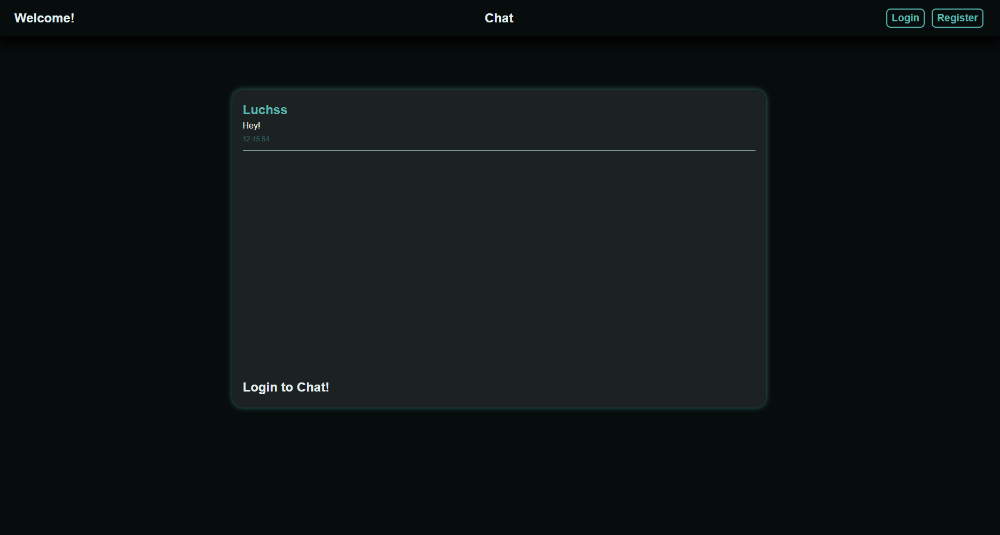

💬 Chat App

Ein moderner Fullstack-Chat mit Benutzerverwaltung, Echtzeitkommunikation.
Dieses Projekt entstand zu Lernzwecken.

✨ Features

- Registrierung & Login mit Passwort-Hashing (bcrypt)
- Profilverwaltung (Benutzername, E-Mail, Passwort ändern)
- Echtzeit-Chat mit WebSockets
- Nachrichtenverlauf (letzte 50 Nachrichten)
- Fehlerbehandlung & Validierung im Frontend & Backend
- Logout-Funktion

🛠️ Technologien

Frontend:

- React
- React Router
- Axios
- CSS

Backend:

- Node.js
- Express
- express-validator
- bcrypt
- WebSocket (ws)

Datenbank:

- MySQL (mysql2)

## 📁 Projektstruktur
```
chat-app/
├── backend/
│   ├── server.js # Express- und WebSocket-Server
│   ├── users.js # Datenbankfunktionen
│   └── validation/ # Validierungsschemas
└── frontend/
    └── src/
        ├── components/ # Chat, Login, Register, Profile, Navbar
        ├── context/ # AuthContext für Login-Status
        └── styles/ # CSS-Dateien
```
        
⚙️ Installation & Start

Voraussetzungen
Node.js (empfohlen: v18+)

MySQL-Datenbank

Backend konfigurieren
.env Datei im Ordner backend/ erstellen.

Beispiel .env:
```
DB_USER=USER
DB_PASSWORD=PASSWORD
DB_NAME=NAME
```

Abhängigkeiten installieren

cd frontend
npm install

cd ../backend
npm install

Das Backend nutzt folgende Hauptabhängigkeiten:
- express
- bcrypt
- cors 
- dotenv 
- express-validator
- mysql2
- ws

Entwicklertools:
- nodemon (für automatischen Neustart bei Codeänderungen)

Das Frontend verwendet u.a. diese Hauptabhängigkeiten:
- react
- react-dom
- react-router-dom
- axios
- react-scripts

Projekt starten
npm start

Frontend läuft standardmäßig auf http://localhost:3000
Backend auf http://localhost:3001

## Screenshots







## Hinweise
- Keine echten Passwörter oder sensible Daten in das Repository hochladen!
- Für produktive Nutzung sollten Authentifizierung und Sicherheit weiter verbessert werden (z.B. JWT).

📜 Lizenz
Dieses Projekt ist ausschließlich zu Lernzwecken gedacht und steht unter keiner speziellen Lizenz.
